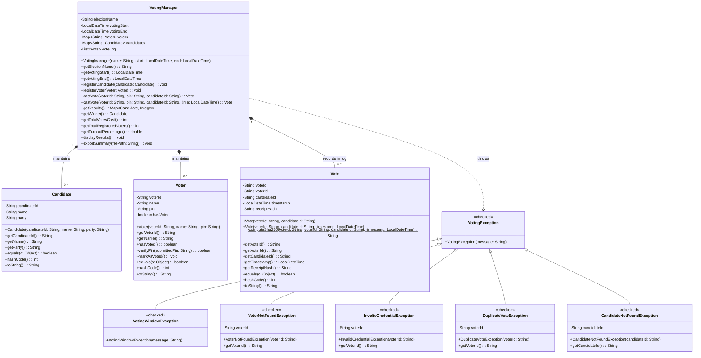
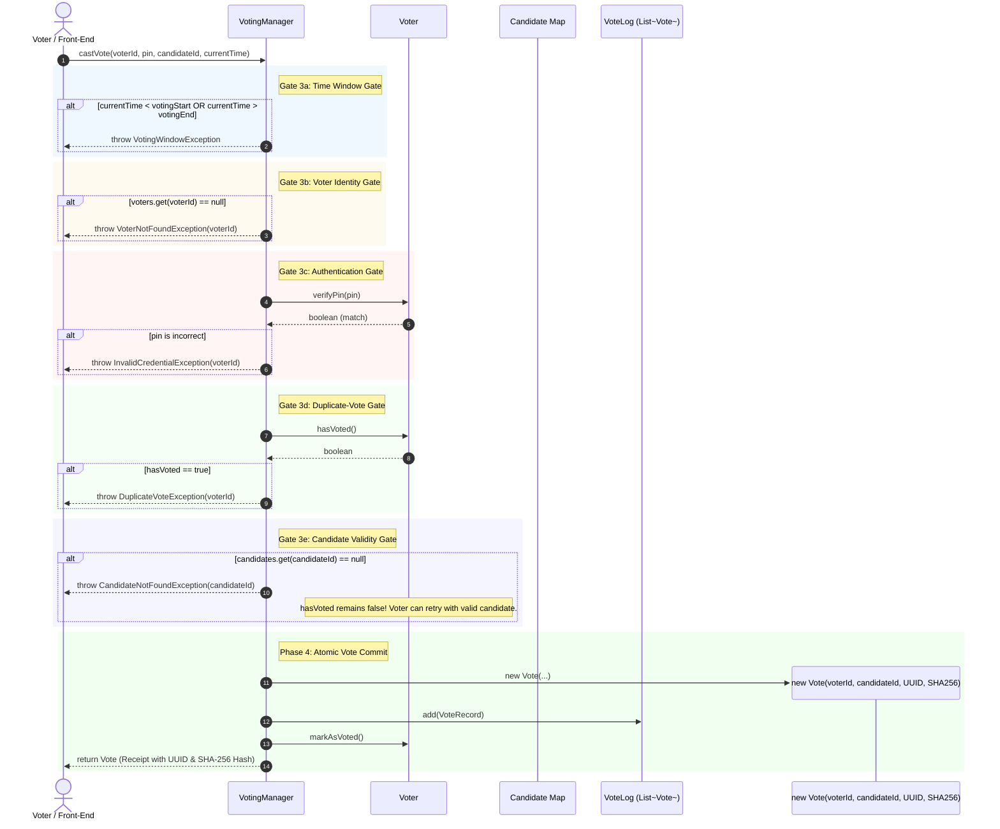

# Online Voting System — Design Document

## 1. System Overview & Architectural Philosophy

The **Online Voting System** is designed to provide secure, verifiable, and strictly regulated electronic elections. Built entirely on Object-Oriented Programming (OOP) principles in Java, the system guarantees:

1. **Election Window Enforcement (Fail-Fast & Immutability):** Elections are bound to an immutable time window; attempts outside this window are blocked before touching any user data.
2. **One Voter, One Vote (Integrity & Uniqueness):** Duplicate voting is strictly prevented through encapsulated state transitions.
3. **Real-Time Voter Verification (ID & Name):** Voters verify eligibility with their Voter ID and Full Registered Name. If already voted, the system immediately displays when they voted, the exact timestamp, and their cryptographic receipt.
4. **Military-Grade AES-256-GCM & SHA-256 Encryption:** Vote payloads and vote IDs are encrypted using authenticated AES-256-GCM tokens in real-time, accompanied by SHA-256 tamper-evident receipt hashes.
5. **Ballot Secrecy & Verifiable Audit Trail:** Votes are immutable; candidate selections are withheld from public audit logs to protect constitutional secrecy while permitting receipt verification.
6. **Real-Time Embedded Web Application:** A zero-dependency embedded Java HTTP server serving a modern Glassmorphic Single Page Application (SPA) with live 2-second background polling.

---

## 2. Architecture & UML Class Diagram

The following Mermaid diagram illustrates the class architecture, attributes, access modifiers, and relationships:

---

## 3. Sequence Diagram: 5-Gate Validation Pipeline

Every invocation of `castVote(voterId, pin, candidateId)` executes the strict sequential pipeline shown below:

---

## 4. Class Specifications & Detailed Descriptions

### 4.1. `Candidate` Class
Represents an individual standing for election.

* **Package:** `com.voting`
* **Attributes:**
  * `private final String candidateId`: Unique immutable identifier (e.g., `"C1"`).
  * `private final String name`: Candidate's full name.
  * `private final String party`: Affiliated political party. Defaults to `"Independent"` if null or blank.
* **Methods:**
  * `public Candidate(String candidateId, String name, String party)`: Validates that ID and name are non-null and non-blank; throws `IllegalArgumentException` otherwise.
  * `public String getCandidateId()`, `public String getName()`, `public String getParty()`
  * `public boolean equals(Object o)` & `public int hashCode()`: Evaluated strictly by `candidateId`. This allows `Candidate` instances to serve reliably as map keys during result aggregation.
  * `public String toString()`: Formatted display string.

### 4.2. `Voter` Class
Represents a registered constituent eligible to cast one ballot.

* **Package:** `com.voting`
* **Attributes:**
  * `private final String voterId`: Unique identifier (e.g., `"V101"`).
  * `private final String name`: Voter's full name.
  * `private final String pin`: Private 4-digit numeric string.
  * `private boolean hasVoted`: Participation flag, initialized strictly to `false`.
* **Methods:**
  * `public Voter(String voterId, String name, String pin)`: Validates that ID/name are non-blank, and that the PIN is exactly 4 numerical characters (`pin.chars().allMatch(Character::isDigit)`). Rejects malformed credentials at construction.
  * `public String getVoterId()`, `public String getName()`
  * `public boolean hasVoted()`: Public accessor for voting status.
  * `boolean verifyPin(String submittedPin)`: **Package-private** method. Protects credentials via encapsulation: `VotingManager` asks the `Voter` object to verify the PIN rather than retrieving and inspecting the raw secret.
  * `void markAsVoted()`: **Package-private** mutator. Sets `hasVoted = true`. Has no public setter, preventing unauthorized modification outside `VotingManager.castVote()`.

### 4.3. `Vote` Class
Represents a permanent, immutable ballot record and cryptographic voter receipt.

* **Package:** `com.voting`
* **Attributes:**
  * `private final String voteId`: Cryptographically random UUID string (`UUID.randomUUID().toString()`).
  * `private final String voterId`: ID of the voter who cast the ballot.
  * `private final String candidateId`: ID of the chosen candidate.
  * `private final LocalDateTime timestamp`: Exact timestamp of ballot generation.
  * `private final String receiptHash`: 64-character SHA-256 hexadecimal hash computed over `voteId + voterId + candidateId + timestamp`.
* **Immutability:** Every field is declared `final`. Once instantiated, no vote record can be modified or tampered with.

### 4.4. `VotingManager` Class
The central controller and domain service coordinating the election lifecycle.

* **Package:** `com.voting`
* **Attributes:**
  * `private final String electionName`: Human-readable title of the election.
  * `private final LocalDateTime votingStart`: Election commencement time.
  * `private final LocalDateTime votingEnd`: Election termination time.
  * `private final Map<String, Voter> voters`: Registry mapping voter ID to `Voter`.
  * `private final Map<String, Candidate> candidates`: Registry mapping candidate ID to `Candidate`.
  * `private final List<Vote> voteLog`: Append-only, chronological list of accepted ballots.
* **Key Methods:**
  * `public VotingManager(...)`: Constructor with fail-fast validation guaranteeing `votingEnd.isAfter(votingStart)`.
  * `public synchronized void registerCandidate(Candidate candidate)`: Prevents duplicate candidate IDs.
  * `public synchronized void registerVoter(Voter voter)`: Prevents duplicate voter IDs.
  * `public synchronized Vote castVote(...)`: Executes the 5-Gate Validation Pipeline and commits the vote.
  * `public synchronized Map<Candidate, Integer> getResults()`: Returns sorted, zero-inclusive candidate tallies.
  * `public synchronized Candidate getWinner()`: Returns highest-tally candidate (or `null` if 0 votes cast).
  * `public synchronized void displayResults()`: Renders the console table.
  * `public synchronized void exportSummary(String filePath)`: Writes the official summary report and secret ballot audit log to disk.

---

## 5. Architectural & Security Rationale

### 5.1. Why the Time Window Gate Runs First (Preventing Voter Enumeration)
If voter lookup ran prior to time-window verification, an external adversary sending requests before or after the election could probe whether specific voter IDs exist based on the response (`VoterNotFoundException` vs. `InvalidCredentialException`). Placing `VotingWindowException` at Gate 3a guarantees that all requests outside the election window fail uniformly, leaking zero identity or credential information.

### 5.2. Why Candidate Validity is Gate 3e (Candidate Rejection Doesn't Lock Out Voter)
A voter must be fully identified, authenticated, and verified as not having voted before candidate validity is checked. If an authenticated voter mistypes a candidate ID:
- The system rejects the vote with `CandidateNotFoundException`.
- Because the vote has not yet been committed (Phase 4), `voter.hasVoted()` remains `false`.
- The voter is **not** disenfranchised and may immediately re-cast for a valid candidate ID.

### 5.3. Encapsulation of Credentials and Mutators
* The voter's PIN is never exposed via a getter.
* `verifyPin()` and `markAsVoted()` are package-private. External packages (such as UI controllers, API routes, or test suites outside the package) cannot invoke `markAsVoted()` arbitrarily. Only `VotingManager` within `com.voting` can flip the flag upon completing all validation gates.

### 5.4. Single Source of Truth for Tabulation
Rather than having each candidate increment a mutable counter upon receiving a vote (which risks state divergence in case of crashes or partial operations), `VotingManager.getResults()` tabulates directly from the immutable `voteLog`. Any tally is derived and reproducible.

### 5.5. Ballot Secrecy in the Audit Trail
The generated `results_summary.txt` exports two distinct sections:
1. **Aggregated Results Table:** Total counts per candidate.
2. **Vote Audit Trail:** Each vote's `UUID`, `Timestamp`, and `SHA-256 Receipt Hash`.
The audit trail **strictly omits** which candidate each individual vote was cast for. This allows a voter to verify that their ballot was recorded and timestamped correctly using their private receipt hash, while preserving constitutional ballot secrecy.
